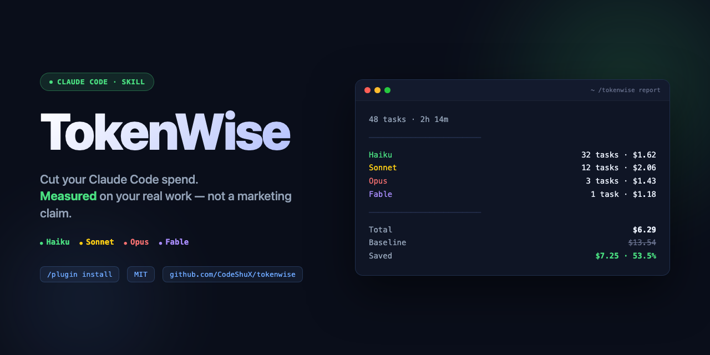

<p align="center">
  
</p>

# TokenWise

> **Cut your Claude Code token spend without sacrificing quality — and prove it.**

[](./LICENSE)
[](https://github.com/CodeShuX/tokenwise/stargazers)
[](https://claude.com/claude-code)
[](https://www.anthropic.com)

A Claude Code skill that routes every task to the model built for it, **measures actual savings on your real workload**, and shows you the proof. Haiku handles the mechanical work, Sonnet executes, Opus reviews, Fable plans — routed automatically by task type, and you get a session report with verified $-saved numbers — not marketing claims.

---

## Table of Contents

- [Why this exists](#why-this-exists)
- [How it works](#how-it-works)
- [Installation](#installation)
- [Usage](#usage)
- [Sample output](#sample-output)
- [How TokenWise compares](#how-tokenwise-compares)
- [FAQ](#faq)
- [What TokenWise is NOT](#what-tokenwise-is-not)
- [Roadmap](#roadmap)
- [Contributing](#contributing)
- [License](#license)

---

## Why this exists

Anthropic's own [Issue #27665](https://github.com/anthropics/claude-code/issues/27665) reports that **93.8% of Max-subscriber tokens flow to Opus** — even when Haiku could have handled the task in a tenth the cost. Users have been asking for auto-routing for a year ([Issue #44976](https://github.com/anthropics/claude-code/issues/44976)). Anthropic hasn't shipped it.

The community has built workarounds. They fall into two camps:

1. **Static catalogs** ([wshobson/agents](https://github.com/wshobson/agents), [VoltAgent/awesome-claude-code-subagents](https://github.com/VoltAgent/awesome-claude-code-subagents)) — every subagent has a pinned `model:` field. Works, but you trust the catalog author's intuition.
2. **Heuristic routers** ([0xrdan/claude-router](https://github.com/0xrdan/claude-router)) — auto-route by task complexity. Claims big savings. **Zero measurement.** You install the config and you're hoping.

TokenWise is the third option: **route + measure + prove**.

Every routed task is logged to `.tokenwise/log.ndjson` with real token counts and cost numbers. `/tokenwise:report` shows what you actually spent vs. what you'd have spent at all-Opus. `/tokenwise:ab "<task>"` runs the same task on Haiku and Sonnet, diffs the outputs, and tells you whether the cheaper tier was good enough.

You don't trust the savings. You verify them.

---

## How it works

Five phases:

1. **Detect** — Scans your Claude Code config, runs probes for known routing bugs ([#36381](https://github.com/anthropics/claude-code/issues/36381), [#47488](https://github.com/anthropics/claude-code/issues/47488)). Refuses to install if routing is broken on your build.
2. **Configure** — Guided mode shows a diff and asks before every write, with automatic backups. Manual mode prints copy-paste blocks and exits. You pick.
3. **Measure** — Every routed subagent appends one NDJSON line to `.tokenwise/log.ndjson` with token counts, costs, escalations, durations. All local. Zero telemetry.
4. **A/B test** — `/tokenwise:ab "<task>"` runs the same task on multiple tiers, diffs outputs, scores quality, writes a report. Use this to validate "is Haiku really good enough for my codebase?" before you trust the router.
5. **Report** — `/tokenwise:report` (this session), `/tokenwise:summary --week` (trend), `/tokenwise:undo` (restore config from backup).

The router classifies every task by type into four tiers — each one a direct, automatic destination, none of them gated behind a confirmation prompt:

| Tier | Model | What it gets |
|---|---|---|
| **Mechanical** | Haiku 4.5 | file reads, grep, format, rename, simple edits, doc lookups |
| **Execution** | Sonnet 4.6 | single-file refactor, test writing, scoped research, code exploration, small-scoped planning |
| **Review** | Opus 4.7 | security review, cross-cutting RCA, auditing outputs, choosing between already-stated options |
| **Planning** | Fable 5 | system-wide architecture, multi-file/cross-cutting design, migration strategy, ambiguous requirements |

Safety caps prevent regressions:
- Haiku never spawns further subagents (if it wants to, the task was wrong-sized)
- Max spawn depth = 2 (parent → subagent → one more tier)
- Trivial-task floor: tasks under 100 chars with no file context run inline (subagent overhead > savings)
- Input bump: if subagent context would exceed 30k tokens, use the next more capable model within a lane (Haiku → Sonnet, Sonnet → Opus). Stops at Opus — Fable is reached by task type, never by input size
- Subagents never self-escalate. A misrouted task returns to the parent, which reclassifies it directly to the correct lane — any lane, one hop — and re-spawns once

---

## Installation

**Prerequisites:**
- [Claude Code](https://claude.com/claude-code) installed (verified on v2.x)

### Option 1 — One-line install via Claude Code marketplace (recommended)

In any Claude Code session, run:

```
/plugin marketplace add CodeShuX/tokenwise
/plugin install tokenwise@tokenwise
```

Then in a fresh session:

```
/tokenwise:install
```

TokenWise will detect your config, show a diff of proposed changes, and ask for confirmation before writing anything.

### Option 2 — Manual clone (no marketplace)

TokenWise ships as 5 command files under `skills/<name>/SKILL.md`, discovered
through the `.claude-plugin/plugin.json` manifest — there's no longer a
single file to symlink. Instead, symlink the whole clone into Claude Code's
plugin cache, the same place `/plugin install` would put it:

```bash
# 1. Clone the repo
git clone https://github.com/CodeShuX/tokenwise.git ~/tokenwise

# 2. Symlink it into Claude Code's plugin cache so all 5 commands register
mkdir -p ~/.claude/plugins/cache
ln -s ~/tokenwise ~/.claude/plugins/cache/tokenwise
```

Restart Claude Code, then verify with `/tokenwise:install`. If the command
isn't recognized, your Claude Code build's plugin cache layout may differ —
fall back to Option 1 (marketplace install), which is the supported path.

---

## Usage

### First-time setup

```
/tokenwise:install
```

TokenWise will:
1. Read your `~/.claude/CLAUDE.md`, project `CLAUDE.md`, and `~/.claude/settings.json`
2. Run probes against your Claude Code build (catches Anthropic Issues #36381 and #47488)
3. Show you the proposed diff for each file
4. Back up each file before modifying (`<file>.tokenwise-backup-<timestamp>`)
5. Write the routing rules + optional env vars

If you'd rather copy-paste than have TokenWise write your config:

```
/tokenwise:install --manual
```

Preview without writing anything:

```
/tokenwise:install --dry-run
```

### Daily use

After install, **nothing changes in your workflow**. Just use Claude Code normally. The router runs in the background. Every routed task is logged.

When you want to see savings:

```
/tokenwise:report          # this session
/tokenwise:summary --week  # last 7 days
/tokenwise:summary --all   # everything in the log
```

When you want to validate the router on a specific task:

```
/tokenwise:ab "rename all uses of getCwd to getCurrentWorkingDirectory across the codebase"
```

TokenWise runs the task on Haiku and Sonnet separately, diffs the outputs, scores them, and writes `tokenwise-ab-<timestamp>.md` to your project root.

When you want to undo TokenWise's config changes:

```
/tokenwise:undo
```

Lists all `.tokenwise-backup-*` files and lets you restore one.

---

## Sample output

### Session report

```
TokenWise Session Report
========================

Tasks routed:        48
Duration:            2h 14m

Per model:
  Haiku    32 tasks   1.2M input  /  84K output   →  $1.62
  Sonnet   12 tasks   480K input  /  41K output   →  $2.06
  Opus      3 tasks   145K input  /  28K output   →  $1.43
  Fable     1 task     58K input  /  12K output   →  $1.18

Total spent:         $6.29
Baseline (all-Opus): $25.52
Savings:             $19.23  (75.4%)

Quality flags:
  Escalations:        2 (Haiku → Sonnet, mid-task)
  User overrides:     0
  Regressions:        0
```

[See full example reports →](./examples/)

### A/B test

```markdown
# A/B Test — rename getCwd → getCurrentWorkingDirectory
Run: 2026-05-11 14:32:18

## Tier comparison

| Tier   | Tokens (in/out) | Cost   | Duration | Quality |
|--------|-----------------|--------|----------|---------|
| Haiku  | 12.4k / 890     | $0.017 | 4.2s     | 8/10    |
| Sonnet | 11.8k / 1.2k    | $0.053 | 6.8s     | 9/10    |

## Recommendation

For this task class, **Haiku is sufficient** (quality 8/10, 68% cheaper).
```

---

## How TokenWise compares

| Tool | Routes | Measures | A/B tests | Telemetry |
|---|---|---|---|---|
| **TokenWise** | ✅ | ✅ | ✅ | ❌ (local-only) |
| [0xrdan/claude-router](https://github.com/0xrdan/claude-router) | ✅ | ❌ | ❌ | ❌ |
| [wshobson/agents](https://github.com/wshobson/agents) | ✅ (static pin) | ❌ | ❌ | ❌ |
| [VoltAgent/awesome-claude-code-subagents](https://github.com/VoltAgent/awesome-claude-code-subagents) | ✅ (static pin) | ❌ | ❌ | ❌ |
| [ccusage](https://github.com/ryoppippi/ccusage) | ❌ | ✅ | ❌ | ❌ |
| LiteLLM / OpenRouter | ✅ (cross-vendor) | ❌ | ❌ | varies |

**TokenWise is the only tool that closes the loop: route → measure → prove → adjust.** ccusage measures but doesn't route. claude-router routes but doesn't measure. Static catalogs do neither dynamically.

---

## FAQ

### How much will it actually save me?

That depends on your workload. The router can only save what's safe to route — a session that's 90% architecture decisions won't see big savings; a session that's 90% file reads will. **The point isn't a guaranteed %. The point is that you'll know your real %, because TokenWise measures it.**

Current Anthropic pricing (Aug 2026, per 1M tokens):

| Model | Input | Output |
|---|---|---|
| Fable 5 | $10 | $50 |
| Opus 4.7 | $5 | $25 |
| Sonnet 4.6 | $3 | $15 |
| Haiku 4.5 | $1 | $5 |

Opus is 5× more expensive than Haiku for the same token, and Fable is 2× Opus on top of that. A task routed correctly to Haiku costs 20¢ on the dollar. Fable is the Planning lane: large architecture and cross-cutting design route there automatically, and everything else routes cheaper. A Planning task logs negative savings against the all-Opus baseline by design — the report shows you exactly what planning costs, and the installer prints a one-time pricing heads-up so it's never a surprise.

### Does it work with my Claude Code build?

TokenWise probes your build at install time. Specifically:
- **Issue #36381** — `CLAUDE_AUTOCOMPACT_PCT_OVERRIDE` was silently ignored in some Claude Code versions. TokenWise sets-and-reads-back to verify it's honored.
- **Issue #47488** — Subagent `model:` param was silently overridden in some versions. TokenWise spawns a probe Haiku subagent and verifies the model param took effect.

If either probe fails, TokenWise refuses to install and tells you exactly which Anthropic issue is affecting you.

### Is my data sent anywhere?

**No.** TokenWise has zero telemetry. All logs are append-only NDJSON in `.tokenwise/log.ndjson` in your project. Task descriptions are truncated to 80 chars and stripped of file contents before logging. There is no analytics endpoint, no error reporter, no usage tracker.

You can audit this by reading `skills/install/SKILL.md` and grepping for any network call. There aren't any.

### Will TokenWise modify my files?

Only the ones you explicitly approve at install time:
- `~/.claude/CLAUDE.md` (or project `./CLAUDE.md` — you pick)
- `~/.claude/settings.json` (only if the env-var probe passes)

Every write requires `[Y/n]` confirmation. Every original is backed up to `<file>.tokenwise-backup-<timestamp>`. `/tokenwise:undo` restores in one command.

If you'd rather not have TokenWise touch your files at all, run `/tokenwise:install --manual` — it prints copy-paste blocks and exits without writing anything.

### What about prompt caching?

Anthropic's 90% cached-input discount is honored automatically. TokenWise reports raw cost (conservative) — actual savings on cached reads will be larger than reported. The **prompt-cache hint detector** flags files re-read 3+ times in a session as cache-eligible.

### Does this work outside Claude Code?

No. TokenWise is Claude-Code-specific by design. If you need cross-vendor routing (Claude + GPT + Gemini), use [LiteLLM](https://github.com/BerriAI/litellm) or [OpenRouter](https://openrouter.ai). TokenWise stays in its lane — Anthropic-only, Claude-Code-only — and does that lane better than anything else.

### What if a task gets routed wrong?

Two things:
1. **Safety caps** — if a subagent realizes it was misclassified, it returns to the parent without re-routing itself. The parent reclassifies directly to the correct lane — any of the four, in one hop — and retries once. The reclassification is logged so you can see how often it happens.
2. **A/B test mode** — `/tokenwise:ab "<task>"` runs the same task on multiple tiers and scores them. If you're nervous about a tier for some task class, run the A/B once and see.

The most common reclassification pattern is `Mechanical → Execution` for tasks that turn out to touch more than one file. That's worth knowing — and TokenWise tells you.

### What's the license?

MIT. Use it commercially, modify it, redistribute it. See [LICENSE](./LICENSE).

---

## What TokenWise is NOT

| Tool | Use case |
|---|---|
| **LiteLLM / OpenRouter** | Multi-vendor routing across Anthropic / OpenAI / Google |
| **Anthropic Batch API** | Bulk async work with a 24h SLA (50% discount) |
| **ccusage / claude-monitor** | Token tracking without routing |
| **wshobson / VoltAgent catalogs** | Static subagent libraries with pinned models |
| **TokenWise** | **Measurement-driven routing for Claude Code, Anthropic-only** |

TokenWise doesn't replace any of these. It fills the gap they don't cover: "is my routing actually saving me money, and how would I know?"

---

## Roadmap

**v0.2** (shipped) — Fable 5 as a 4th automatic routing tier (Planning), symmetric 4-way task-type classification, reclassification model replacing ladder escalation. See [CHANGELOG](./CHANGELOG.md).

**v0.3** (planned)
- Pre-task cost estimator
- GitHub Action — run `/tokenwise:report` on PR previews, comment savings
- Multi-month digest with trend lines
- YAML-editable routing taxonomy (override the defaults for your codebase)
- Budget cap — alert when session crosses a configured $ threshold

**v1.0** (later)
- Workload profiles — save "my-Rails-app" taxonomy as a sharable profile
- Self-healing prompt rewrites (rewrite a task description so Haiku can handle it)
- Cost projection across full project history

---

## Contributing

PRs welcome. See [CONTRIBUTING.md](./CONTRIBUTING.md).

Areas where help is most needed:
- **Pricing updates** when Anthropic publishes new rates
- **Routing taxonomy refinements** — backed by A/B test reports
- **Cross-platform install testing** (Mac / Linux / Windows / WSL)
- **Troubleshooting docs** for common Claude Code routing-bug workarounds

---

## License

MIT — see [LICENSE](./LICENSE).

---

## Acknowledgments

Built on the routing primitives in [Claude Code](https://claude.com/claude-code) by Anthropic. Inspired by community workarounds in [Issue #44976](https://github.com/anthropics/claude-code/issues/44976) and the "Opus orchestrator, Haiku subagents" pattern surfaced by [@sakeeb.rahman](https://www.threads.com/@sakeeb.rahman/post/DUQOcC2kUpb).

---

<p align="center">
  
</p>

<p align="center">
  <a href="https://github.com/CodeShuX/tokenwise">github.com/CodeShuX/tokenwise</a> · <a href="./LICENSE">MIT</a>
</p>
